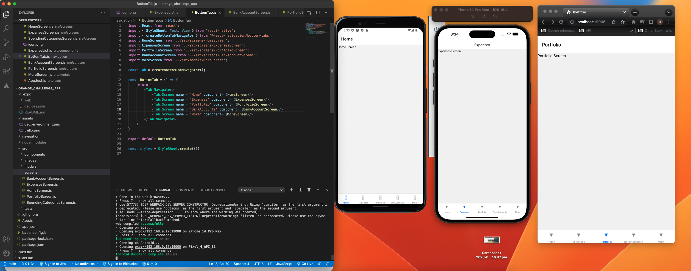

# Orange Challenge APP

## Objective

- To display knowledge of current web development processes by creating a simple 3 page application using React Native.
- Communicate through code by use of comments to display knowledge to others for production purposes
- Show correct project planning techniques through README file including user stories, identifying MVP and TrelloBoard.
- Display organisation techniques through use of correct industry standard file structure for scalability and maintainability.
- Write clean and dry code that is efficient

## User Stories

- As a user, they want to be able to view their financial situation through the use of a single application.

- As a user, they want to be able to view their accounts too assess their financial situation

- As a user, they want to be able to view their current expenditures

- As a user, they want to be able to sort their expenditures into different categories

## Minimum Viable Product

- Users are directed to Home page that displays their financial history at a glance, including a graph that displays total value and a list of current financial account levels.

- Users can navigate to their Expenses, Portfolio and Accounts via navigation bar.

- Expenses Screen shows Easy to read pie chart showing current expenditures as well as Top Spending categories

- Users can navigate from Expenses screen to view All Spending Categories.

## Trello Board

## File Structure

## Development environment

## Testing

